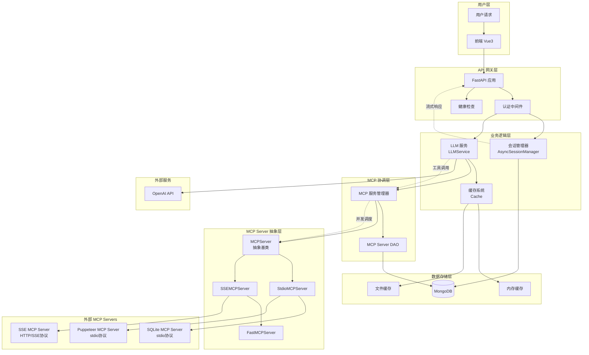

# MCP Agent 后端工程设计分析

## 项目概述

MCP Agent 是一个支持多 MCP Server 调度的智能代理系统，能够通过多种协议（SSE/HTTP 和 stdio）与不同的 MCP Server 进行通信，并集成 LLM 服务实现智能对话和自动化任务。

## 系统架构图



## 1. 核心架构组件

### 1.1 主应用模块 (`main.py`)

- **FastAPI 应用**: Web 服务器入口，提供 RESTful API
- **会话管理**: 支持多会话对话管理
- **流式响应**: SSE 方式的实时消息推送
- **MCP Server 管理**: 动态增删改查 MCP Server 配置
- **健康检查**: 系统状态监控

**核心接口:**
- `/sessions` - 会话列表
- `/chat/{chat_id}/session/completion` - 对话补全（流式）
- `/servers` - MCP Server 管理
- `/health` - 健康检查

### 1.2 LLM 服务 (`llm_service.py`)

- **多协议 MCP 集成**: 同时支持 SSE 和 stdio 协议
- **智能工具调用**: 自动判断并执行 MCP 工具
- **流式生成**: 支持实时响应生成
- **工具链调用**: 支持多轮工具调用链
- **嵌入向量**: 文本嵌入生成服务

**主要特性:**
- 自动从所有 MCP Server 聚合工具列表
- OpenAI Function Calling 格式转换
- 错误处理和重试机制
- 热加载/卸载 MCP Server

### 1.3 会话管理 (`session_manager.py`)

- **异步会话管理**: 基于 Motor MongoDB 的异步操作
- **消息存储**: 结构化消息存储和检索
- **会话生命周期**: 创建、删除、清空、归档会话
- **实时同步**: 自动同步会话状态

**数据模型:**
- `ChatSession`: 会话实体
- 消息集合: 按会话ID组织的消息存储

### 1.4 MCP Server 抽象层 (`server.py`)

**抽象基类 `MCPServer`:**
- `initialize()`: 初始化连接
- `list_tools()`: 获取工具列表
- `execute_tool()`: 执行工具
- `cleanup()`: 资源清理

**具体实现:**
- `StdioMCPServer`: 基于标准输入输出的 MCP Server
- `SSEMCPServer`: 基于 SSE/HTTP 的 MCP Server (继承自 FastMCPServer)

### 1.5 FastMCP 客户端 (`servers/sse_server.py`)

- **SSE 协议支持**: 基于 Server-Sent Events 的实时通信
- **连接管理**: 自动连接建立和维护
- **工具代理**: 透明的工具调用代理

**类继承关系:**
```
MCPServer (抽象基类) ← sse_server.py
    ├── FastMCPServer ← sse_server.py
    │   └── SSEMCPServer ← server.py
    └── StdioMCPServer ← server.py
```

### 1.6 缓存系统 (`cache.py`)

- **双层缓存**: 内存缓存 + 文件持久化
- **TTL 过期**: 基于时间的缓存过期机制
- **线程安全**: 支持并发访问
- **性能优化**: 减少重复计算和 API 调用

### 1.7 数据访问层 (`mcp_server_dao.py`)

- **Server 配置管理**: 从 MongoDB 读取启用的 MCP Server 配置
- **简单数据接口**: 为 LLM 服务提供数据访问

### 1.8 工具模块

- **认证模块** (`auth.py`): API 密钥验证
- **配置加载** (`config.py`): YAML 配置文件解析
- **实用工具** (`utils.py`): JSON 解析、函数调用解析等辅助功能

## 2. 数据流架构

```
用户请求 → FastAPI 路由 → 会话管理器
    ↓
LLM 服务 ← MCP Server DAO ← MongoDB 配置
    ↓
工具选择 → MCP Server 调度器
    ↓
具体 MCP Server (SSE/stdio) → 工具执行
    ↓
缓存处理 → 结果返回 → 流式响应
```

## 3. 通信协议支持

### 3.1 SSE (Server-Sent Events)

- **实时推送**: 服务器主动推送消息
- **HTTP 兼容**: 基于标准 HTTP 协议
- **FastMCP 集成**: 使用 FastMCP 客户端库

### 3.2 stdio (标准输入输出)

- **本地进程**: 通过子进程调用本地 MCP Server
- **MCP 标准**: 符合 MCP 协议标准
- **灵活配置**: 支持任意命令行和参数

## 4. 配置管理

### 4.1 环境变量 (`.env`)

```env
API_KEY=OpenAI API 密钥
BASE_URL=LLM 服务端点
MONGO_URI=MongoDB 连接字符串
MODEL=使用的 LLM 模型
```

### 4.2 MCP Server 配置 (`config.yaml`)

```yaml
mcp_servers:
  - name: "local_sse"
    url: "http://localhost:3002/sse"
    mode: "sse"
    api_key: "token1"
  - name: "sqlite"
    mode: "stdio"
    command: "uvx"
    args: ["mcp-server-sqlite", "--db-path", "./test.db"]
```

## 5. 系统特性

### 5.1 并发处理

- **异步架构**: 基于 asyncio 的全异步处理
- **多 Server 并发**: 同时与多个 MCP Server 通信
- **工具链调用**: 支持智能的多轮工具调用
- **连接池管理**: 高效的连接资源管理

### 5.2 扩展性设计

- **插件化架构**: 新 MCP Server 可通过配置文件动态添加
- **热加载**: 支持运行时启用/禁用 MCP Server
- **协议扩展**: 抽象接口支持新通信协议
- **功能模块化**: 易于添加新的工具和功能

### 5.3 可观测性

- **结构化日志**: 详细的操作日志记录
- **健康检查**: 系统状态监控接口
- **错误处理**: 分层错误捕获和处理
- **性能监控**: 缓存命中率、响应时间等指标

### 5.4 安全性

- **API 密钥认证**: 基于头部的 API 密钥验证
- **环境变量**: 敏感信息通过环境变量管理
- **沙箱执行**: stdio 模式的安全执行环境
- **访问控制**: 精细化的权限管理

## 6. 技术栈总结

| 层级 | 技术选型 | 说明 |
|------|----------|------|
| Web 框架 | FastAPI | 现代、高性能的 Python Web 框架 |
| 异步处理 | asyncio | Python 原生异步编程支持 |
| 数据库 | MongoDB | 文档数据库，适合聊天记录存储 |
| 数据库驱动 | Motor | MongoDB 的异步驱动 |
| LLM 集成 | OpenAI API | 大语言模型服务 |
| MCP 协议 | mcp + fastmcp | MCP 协议的标准实现 |
| 缓存 | 内存 + 文件 | 双层缓存设计 |
| 配置管理 | YAML + 环境变量 | 灵活的配置管理 |
| 前端 | Vue3 + Element Plus | 现代前端技术栈 |

## 7. sse_server.py 使用分析

### 7.1 使用位置

**直接导入使用** - `mcp_agent/server.py`:
```python
from mcp_agent.servers.sse_server import MCPServer, FastMCPServer
```

**间接使用** - `mcp_agent/llm_service.py`:
```python
from .server import StdioMCPServer, SSEMCPServer
```

### 7.2 类继承关系

```
MCPServer (抽象基类) ← sse_server.py
    ├── FastMCPServer ← sse_server.py
    │   └── SSEMCPServer ← server.py
    └── StdioMCPServer ← server.py
```

### 7.3 功能作用

`sse_server.py` 提供了：
- **`MCPServer`**: MCP Server 的抽象接口定义
- **`FastMCPServer`**: 基于 FastMCP 库的 SSE 协议实现

### 7.4 实际调用链

```
用户请求 → LLMService → MCP Server 调度 → SSEMCPServer/StdioMCPServer → 实际的 MCP Server
```

## 8. 部署和运维

### 8.1 环境要求

- Python 3.8+
- MongoDB 数据库
- OpenAI API 密钥
- Node.js (用于某些 MCP Server)

### 8.2 启动流程

1. 配置环境变量和数据库连接
2. 启动后端服务：`uvicorn mcp_agent.main:app --host 0.0.0.0 --port 8000`
3. 启动前端服务：`npm run dev`
4. 配置和启用需要的 MCP Server

### 8.3 监控建议

- 监控 MongoDB 连接状态
- 监控 MCP Server 连接健康度
- 监控 LLM API 调用频率和错误率
- 监控缓存命中率和内存使用

## 9. 设计优势

1. **模块化设计**: 各组件职责清晰，易于维护和扩展
2. **协议无关**: 支持多种 MCP 通信协议，适应性强
3. **智能调度**: LLM 驱动的工具选择和调用
4. **高性能**: 异步处理和缓存优化
5. **用户友好**: 流式响应和实时交互
6. **运维友好**: 完善的日志和监控机制

## 10. 潜在改进点

1. **错误处理增强**: 可以添加更精细的错误分类和处理策略
2. **性能监控**: 增加更详细的性能指标收集
3. **配置热重载**: 支持配置文件的热重载
4. **负载均衡**: 对多个相同类型的 MCP Server 进行负载均衡
5. **安全加固**: 增加更多的安全验证和防护机制

---

*最后更新时间: 2024年12月*
